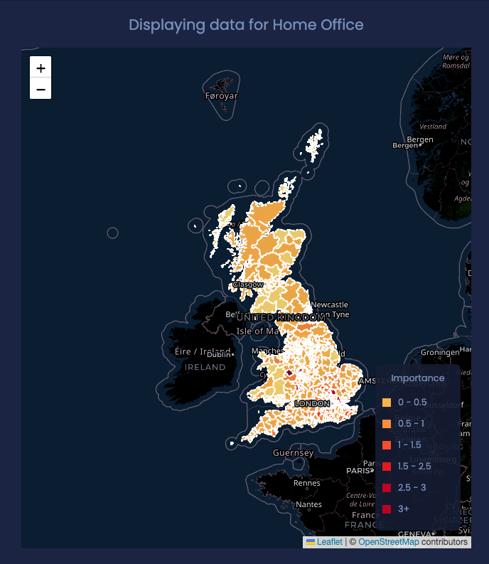

# UK Petitions Dashboard

## 🚪 Introduction

This is a dashboard that displays the UK Petition data on a Map, Bar-Graph, Line-Chart and Doughnut Charts.

---

## 👨‍💻 Technologies

### Front End

- React 18.2.0
- React-dom 18.2.0
- Node Sass 7.0.1
- chart.js 3.8.2
- Axios 0.27.2
- leaflet-choropleth 1.1.4
- leaflet 1.8.0
- react-leaflet 4.0.1
- react-chartjs-2 4.3.1
- react-google-charts 4.0.0
- Moment 2.29.1

### Back End

- Node 16.13.2
- Express 4.18.1
- Axios 0.27.2
- dotenv 16.0.1
- moment 2.29.4
- CORS 2.8.5
- Moment 2.29.1
- Mongoose 6.4.5

---

## 🧐 Features

- Map displaying importance of each UK Contituencies voting on a certain Petition Topic

- Bar Chart dipslaying petitions debated per year for either a certain petition topic or all petitions

- Line Chart displaying displaying the number of petitions per year

- Doughnut Chart Dispalying number of Closed, Open and rejected petition for a certain Petition Topic or all petitions

- Doughnut Chart showing the proportions of each petition theme in all petitions. 

---

## 🛠️ Setting up Development Enviroment

### Clone and Install

    git clone https://github.com/uceseoo/UK-petitions-dashboard.git

### Open two terminals, one for the client, other for the server

**Set up client/front end side -**

    cd client #from main directory
    npm install #to install install dependencies

**Set up server/back end side -**

    cd server #from main directory
    npm install #to install install dependencies

when installation is completed, you'd create an `.env` file, and check the `.env.example` file to see the variables that need to be in your newly created `.env` file.

## Launch App

First launch the server side, so;

    cd server #from main directory
    npm start

server should be running on http://localhost:5000/

Then, launch the client side

    cd client #from main directory
    npm start

Go to http://localhost:3000/ to see the app live

---

## 💡 Reflection

A personal and academic project to enhance my knowledge on building a full-stack GIS application from scratch using React.JS and Node.JS. The interactive Web App dashboard displays UK Petitions live data, the key indicator or metric being the distribution of interest in various petition petition themes/topics across the UK.

---

## 📸 Screenshots

---

## 📝 License

Copyright (c) 2022 Elias

---

## 📍 Contact

- Email : eliasotieno@gmail.com
